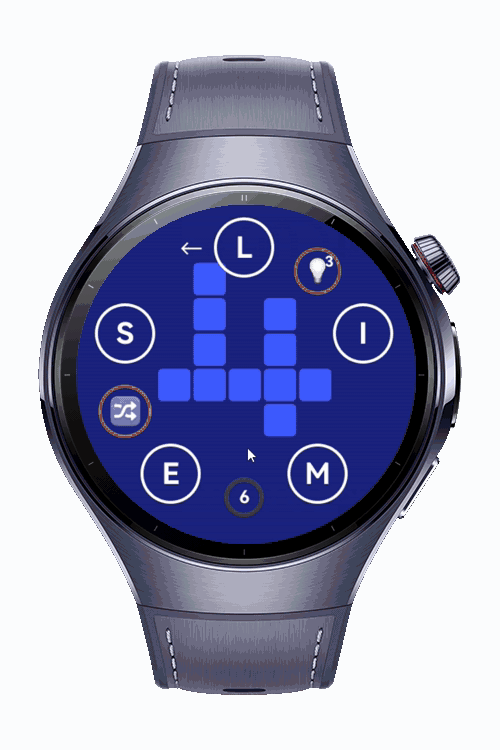
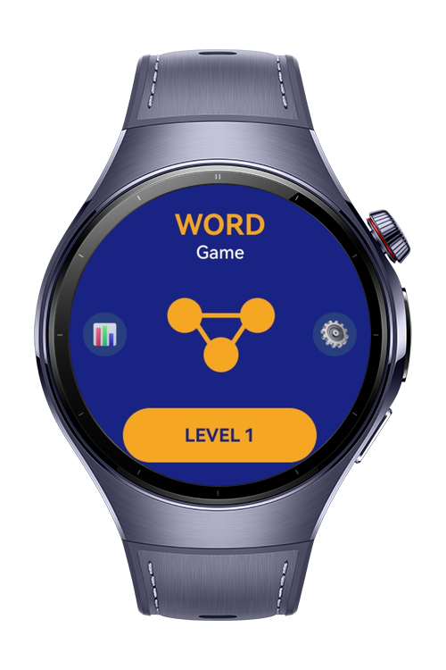
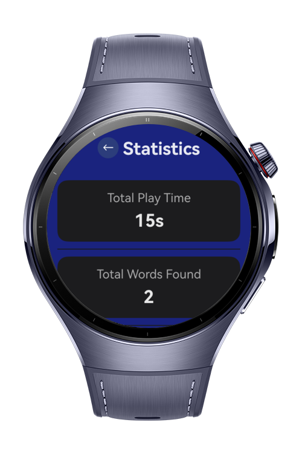
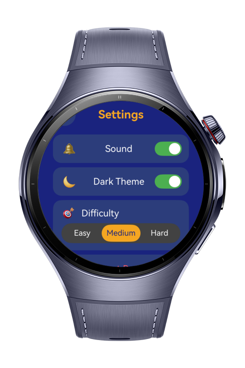

> **Note:** To access all shared projects, get information about environment setup, and view other guides, please visit [Explore-In-HMOS-Wearable Index](https://github.com/Explore-In-HMOS-Wearable/hmos-index).

# Word Game Wearable

A word puzzle game built for *HarmonyOS Next* smartwatches. Draw lines through letter circles to spell words hidden in a crossword grid.

---

# Preview

<div>




</div>

# Use Cases

- A quick mental workout you can do on your wrist without pulling out your phone.
- Learning and reinforcing English vocabulary through active recall.
- A low-friction game designed for short play sessions — each level takes one to three minutes.

---

## Game Mechanics

There are 10 levels split across four difficulty tiers:

| Difficulty | Levels |
|------------|--------|
| Easy       | 1      |
| Medium     | 2 – 6  |
| Hard       | 7 – 9  |
| Expert     | 10     |

Each level gives you a set of letters arranged in a circle and a crossword-style grid in the center. Words are placed horizontally or vertically in the grid. Your job is to find all of them.

**Main words** must all be found to complete a level and unlock the next one. **Bonus words** are valid English words that can be formed from the same letters but aren't required — finding them adds to your score.

Three tools are available during each level:

- **Hint** — reveals one letter of an unsolved word. You get three per level, and each one costs you points.
- **Shuffle** — rearranges the letter positions on the ring without changing which letters are available.
- **Bonus indicator** — a small counter showing how many bonus words you've found.

A first-time tutorial walks new players through the swipe mechanic on the first launch. It doesn't repeat until the app is reinstalled.

---

## Scoring

Each level is scored out of 100 points:

```
Main score   = 60 × (words found / total main words)
Bonus score  = 40 × (bonus words found / total bonus words)
             = 40 flat if the level has no bonus words

Hint penalty = hints used × 20

Final score  = max(0, main score + bonus score − hint penalty)
```

Scores translate to a star rating shown on the win screen:

| Stars | Minimum Score |
|-------|--------------|
| 1     | 1            |
| 2     | 21           |
| 3     | 41           |
| 4     | 61           |
| 5     | 81           |

---

## Controls

The game uses a single swipe gesture. Touch any letter and drag through adjacent letters to spell a word — the line follows your finger and highlights each letter as you pass over it. Lift your finger to submit.

| Action        | How                                      |
|---------------|------------------------------------------|
| Select letters | Drag finger through letter circles      |
| Submit word    | Lift finger                             |
| Use a hint     | Tap the hint button (upper-right area)  |
| Shuffle letters | Tap the shuffle button (left area)     |

---

# Tech Stack

**Language**

ArkTS — HarmonyOS's TypeScript variant, written in `.ets` files. UI is built with the ArkUI declarative component model.

**Tools**

DevEco Studio is the primary IDE for development, preview, and running tests. Builds are driven by `hvigor`.

**Libraries & Kits**

| Library / Kit       | Usage                                                  |
|---------------------|--------------------------------------------------------|
| ArkUI               | Declarative UI components and layout                   |
| `media.SoundPool`   | Low-latency MP3 playback for sound effects             |
| `PersistentStorage` | Persisting level progress and settings across sessions |
| `NavPathStack`      | Page navigation via `@Provide` / `@Consume`            |
| Hypium              | Unit and device test framework                         |
| Hamock              | Mocking library used alongside Hypium                  |

---

# Directory Structure

```
entry/src/main/ets/
├── common/
│   ├── Constants.ets           # Colors, sizes, layout constants, page names
│   └── SoundManager.ets        # Singleton sound pool wrapper
├── components/
│   ├── HintButton.ets          # Animated hint button
│   ├── BackButton.ets          # Navigation back button
│   └── PillButton.ets          # Reusable pill-shaped button
├── model/
│   └── LevelData.ets           # Level definitions (10 levels) and persistence keys
├── viewmodel/
│   └── GameViewModel.ets       # GameState singleton, all game logic
├── pages/
│   ├── Index.ets               # App root, NavPathStack provider, storage init
│   ├── HomePage.ets            # Main menu
│   ├── LevelSelectPage.ets     # 4×5 level grid (built, not yet wired to nav)
│   ├── GamePage.ets            # Core gameplay screen
│   ├── WinPage.ets             # End-of-level star rating and confetti
│   └── SettingsPage.ets        # Sound toggle and theme settings
└── entryability/
    └── EntryAbility.ets        # App lifecycle, sound pool init/release

entry/src/main/resources/
└── rawfile/                    # MP3 sound effects
    ├── correct_word.mp3
    ├── wrong_word.mp3
    ├── level_complete.mp3
    └── shuffle.mp3
```

---

# Constraints and Restrictions

## Supported Devices

- Huawei Watch GT 6
- HarmonyOS 6.0

# License

A word puzzle game is distributed under the terms of the MIT License.
See the [LICENSE](/LICENSE) for more information.
